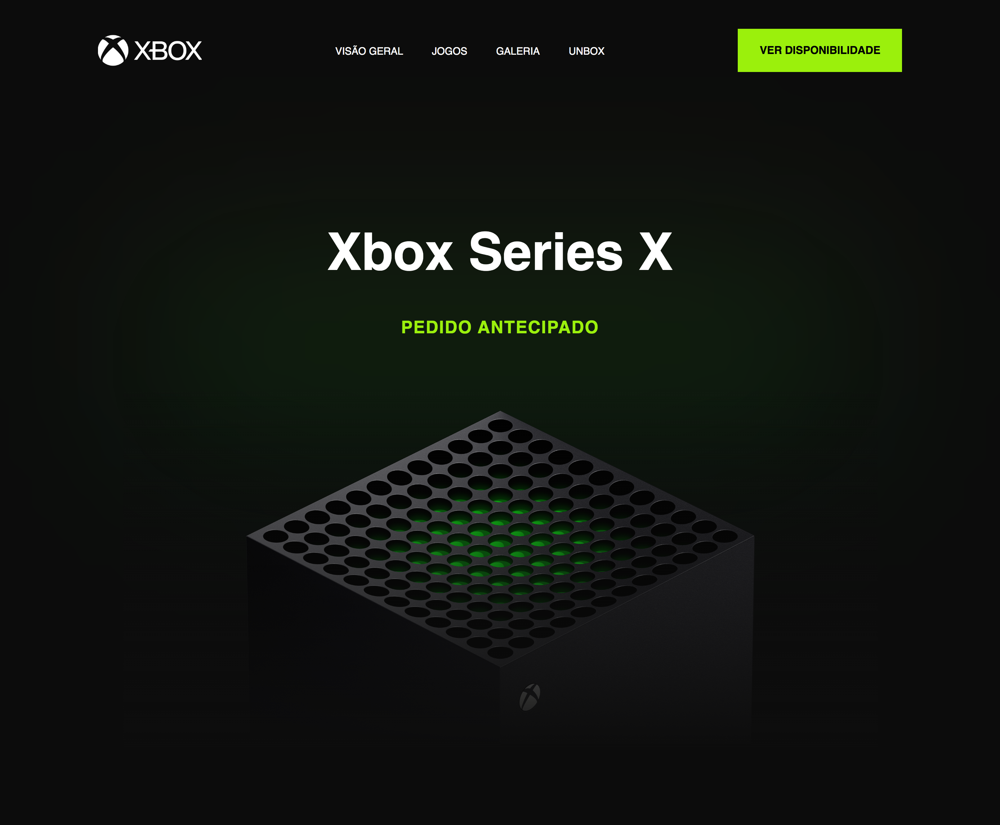

<h2 align="center"> XBOX SERIES X </h2>

 

Utilizando Scss o projeto Xbox Series X foi construído a base do FIGMA, 100% responsivo e animado.

  

 

## 🚀 Tecnologias
- HTML
- SCSS
- AOS ANIMETE
- FIGMA

## ⚡️ Layout
- Breakpoints: 1200px, 991px, 767px, 575px, 510px
- <a href="https://www.figma.com/file/Yb9IBH56g7T1hdIyZ3BMNO/Desafios---Codel%C3%A2ndia?node-id=64381%3A758&t=KF1bNwKFudk3lQ5O-0">Desafio 21 (Codelândia)</a>

## 🧠 Autor

- [@paulopariz](https://www.github.com/paulopariz)

  

<h2 align="center">Contato:</h2>

    

 

